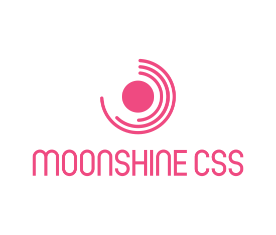

# Moonshine CSS



## Features

- 🥃 Minimal and simple atomic CSS framework
- ⚗️ 100% customizable - build your own CSS framework
- 🦀 Blazing fast generator written in Rust
- 🐜 Tiny `1.1 kB` runtime
- ⚛️ React integration

## Install

```bash
npm install --save @econify/moonshine-css
yarn add @econify/moonshine-css
```

## Generate Styles

Create a `.moonshinerc` file in your project root.

by running

```
distill --init
```

or by creating a file manually:

```json
{
  "options": {
    "breakpoints": {
      "sm": "min-width: 576px",
      "md": "min-width: 768px",
      "lg": "min-width: 992px"
    }
  },
  "plugins": [
    "@moonshine/plugin-css-typography",
    "@moonshine/plugin-css-grid",
    "@moonshine/plugin-css-buttons",
    "@moonshine/plugin-css-forms",
    "@moonshine/plugin-css-tables",
    "@moonshine/plugin-css-utilities"
  ],
  "output": {
    "styles": "styles/atomic-styles.css",
    "types": "styles/atomic-styles.d.ts",
    "snippets": ".vscode/atomic-styles.code-snippets"
  }
}
```

then run

```bash
distill --watch
# or
npx @econify/moonshine-css --watch
```

## Usage

```js
import "atomic-styles.css";
```

```js
import { styled } from "@econify/moonshine-css";

const Button = styled.button(
  "bg-blue-500 hover:bg-blue-700 text-white font-bold py-2 px-4 rounded"
);

export default Demo() {
  return (
    <div>
      <Button>Click me</Button>
    </div>
  );
};
```

## Acknoledgements

TBD
